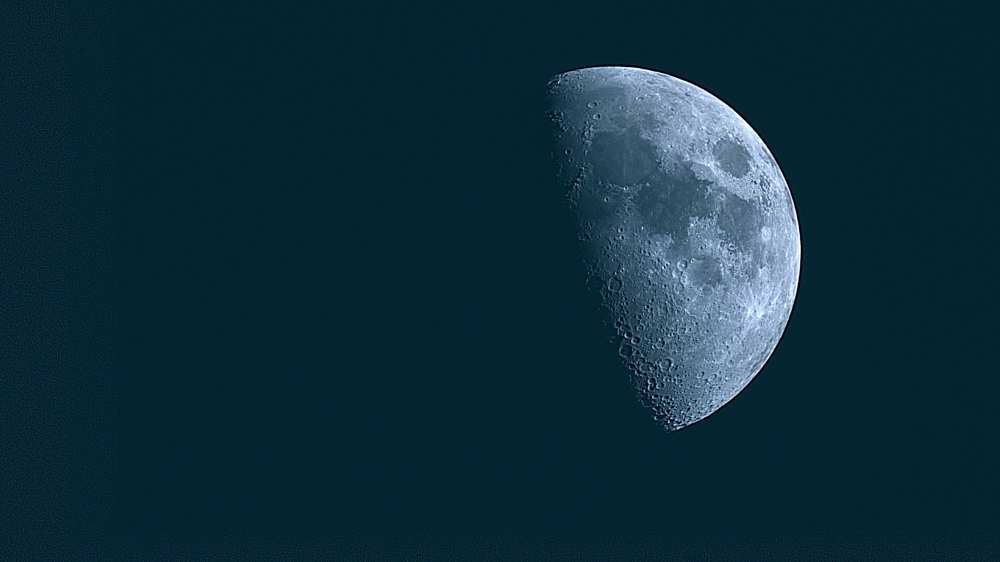
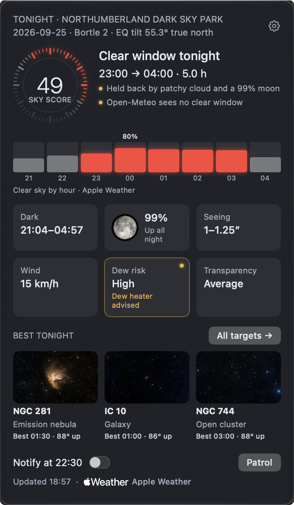
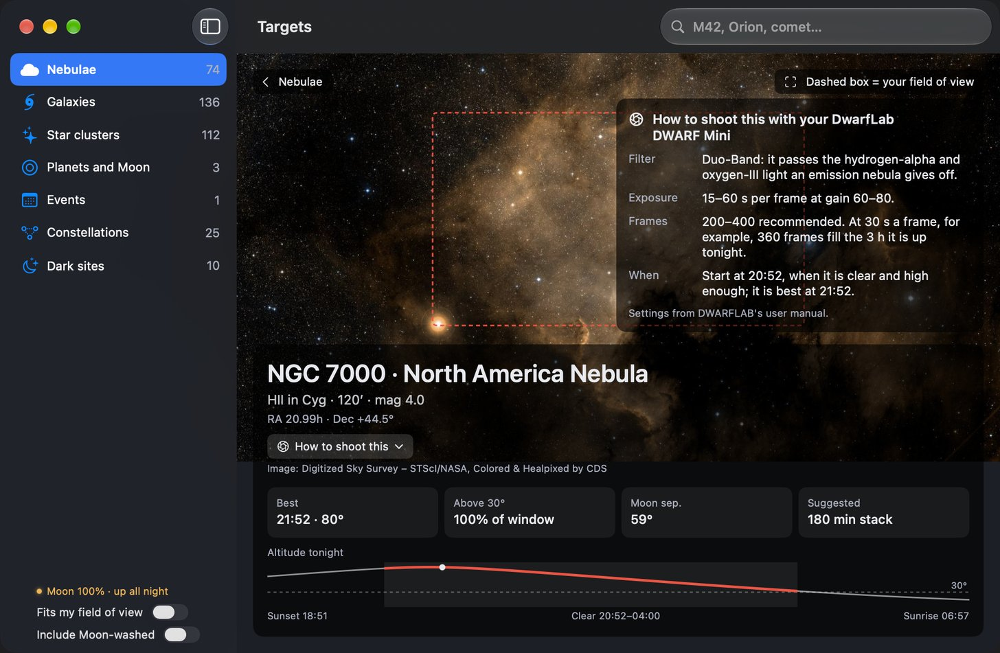
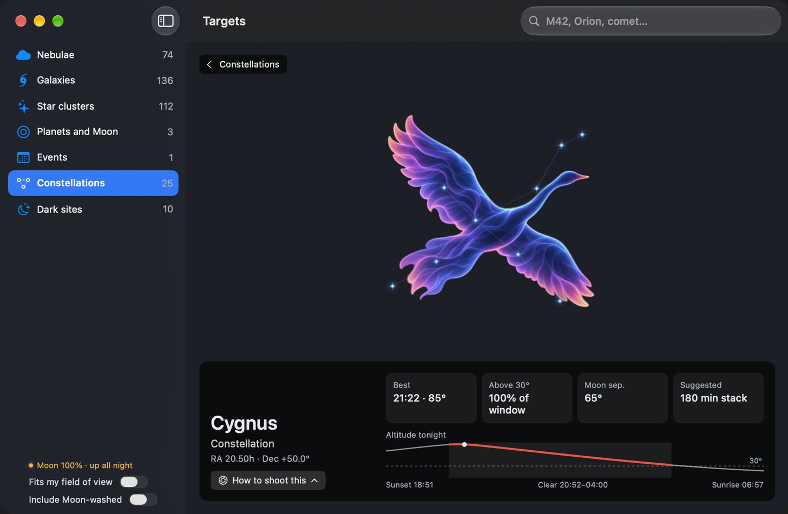
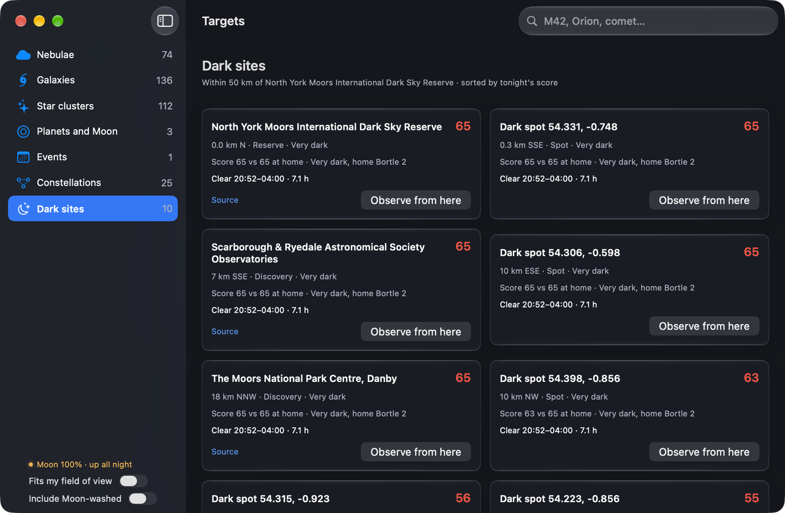
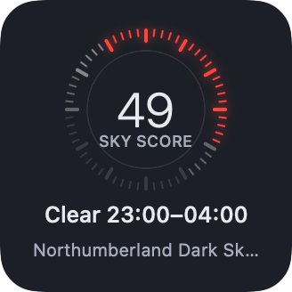
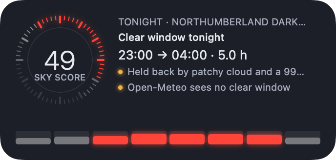
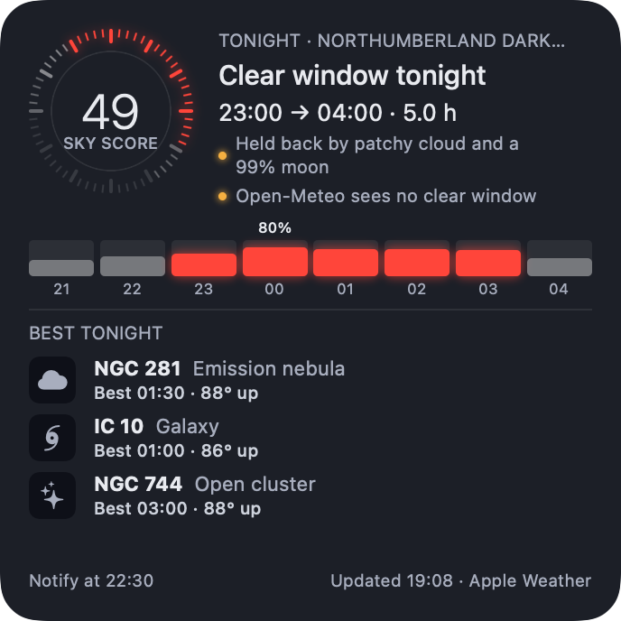

# Nightwatch

*The Moon, DWARF Mini, Richard Sutcliffe.*

Silent macOS menu-bar app: tells you when tonight is clear enough for a long imaging session, and what to point at.

## Screenshots

Taken at the North York Moors International Dark Sky Reserve with version 1.0.

**A target's page:** the survey photo fills the window, the dashed box is your field of view, and "How to shoot this" gives your telescope's filter, exposure and frames.

**All 88 constellations:** each one drawn as a figure over its stars, with when it is best tonight.

**Dark sites:** darker places nearby, scored for tonight against home.

**Desktop widgets:** small, medium and large.

  

## Download

**[Download Nightwatch.dmg](https://github.com/rsutcliffe/nightwatch/releases/latest/download/Nightwatch.dmg)**, always the newest version, signed and notarised. Open it and drag Nightwatch to Applications. Each [GitHub release](https://github.com/rsutcliffe/nightwatch/releases) also carries the same file as `Nightwatch-<version>.dmg`, with its SHA-256 checksum. The first time you open it, macOS asks whether to open an app downloaded from the internet: choose Open. Nightwatch then asks what you image with and where you observe from; "Use this Mac's location" brings up macOS's location prompt, where you choose Allow. Nightwatch checks GitHub once a day for a newer version and says so in the popover (Settings › Updates turns this off). Questions and ideas are welcome in [Discussions](https://github.com/rsutcliffe/nightwatch/discussions); problems in [Issues](https://github.com/rsutcliffe/nightwatch/issues). How a release is made is in [docs/releasing.md](docs/releasing.md), and the Mac App Store build in [docs/app-store.md](docs/app-store.md).

## Build and install (any Mac, macOS 14+, no Xcode needed)

    xcode-select --install        # Command Line Tools, once
    git clone https://github.com/rsutcliffe/nightwatch.git && cd nightwatch
    scripts/fetch-data.sh         # optional: only to refresh the bundled catalogue; the data is committed
    scripts/build-app.sh          # builds, signs ad hoc, installs to /Applications, launches

Every build runs in Apple's app sandbox, including one signed ad hoc. An ad hoc build gets a new signature each time it is rebuilt; if macOS then asks whether Nightwatch may access its data, choose Allow.

The app icon comes from `Resources/AppIcon/Nightwatch.icon`, an Icon Composer document. With Xcode installed, the build compiles it into a Liquid Glass icon with `actool`; with the Command Line Tools alone, `scripts/make-icns.swift` makes a classic icon from the same artwork.

## Desktop widget (optional)

Nightwatch has small, medium and large desktop widgets showing tonight's sky score and verdict. The medium and large ones add the clear-sky bars, and the large one the best three targets. They draw a snapshot the app writes after each refresh, so they always match the popover, and they never fetch anything themselves. Clicking one opens the Targets window; clicking a target on the large one opens its detail.

The widget is built only on a signed build with Xcode and xcodegen installed (`brew install xcodegen`): `scripts/build-app.sh` then generates `Widget/NightwatchWidget.xcodeproj` from `Widget/project.yml`, builds the extension with `xcodebuild` and embeds it. With the Command Line Tools alone the app builds exactly as before, without the widget.

To add it: right-click the desktop › Edit Widgets… › Nightwatch. If widgets won't stay on the desktop, turn on System Settings › Desktop & Dock › Widgets › Show widgets › On Desktop.

## Tests

    scripts/test.sh

## What it does

- Every 30 minutes it fetches cloud, dew point, wind and visibility for your site from Apple Weather (WeatherKit) when the app is signed for it, or from Open-Meteo otherwise, plus 7Timer for seeing and transparency. The popover footer says which one drove tonight's verdict.
- It computes astronomical darkness, Moon, planets and target visibility locally with Astronomy Engine. Nothing leaves your Mac except the forecast requests, thumbnail fetches from CDS, comet/ISS element downloads and, when aurora alerts are on, AuroraWatch UK's status after dark.
- A night qualifies when there is a contiguous run of at least 3 hours inside astronomical darkness with total cloud at or under 25 % (all adjustable).
- Alerts: a heads-up one hour before local sunset, a nudge 30 minutes before the window opens, and a cancel notice if the forecast turns. Quiet hours default to 00:00–07:00. Nothing fires from a forecast older than six hours.
- Bright nights (opt-in, Settings › Bright nights): from about early May to early August at British latitudes there is no proper darkness, so the dark rule can never be met. With this on, Nightwatch suggests the Moon and the naked-eye planets instead and alerts for a one-hour clear run in nautical darkness (Sun 12° down) with a target at least 15° up. Deep-sky targets are never suggested on a bright night.
- Aurora (opt-in, Settings › Aurora): after dark, Nightwatch checks AuroraWatch UK every 5 minutes and alerts when the status reaches your threshold (default amber) and this hour's forecast is clear. Status from AuroraWatch UK, Lancaster University, under its non-commercial terms. Quiet hours apply to aurora alerts too, and around midsummer the default quiet hours (00:00–07:00) cover almost all of the dark part of the night, so shorten them if you want summer aurora alerts.
- The menu-bar icon shows tonight at a glance:

  | Icon | Meaning |
  |---|---|
  | Star outline (☆) | No clear window tonight |
  | Star in a circle (⊛) | A clear window tonight, still to come |
  | Filled star (★) | The window is open, or opens within 30 minutes: time to set up |
  | Star with a slash | The forecast is more than six hours old, for example while offline |

- The popover (v0.4 "Jingo") shows:
  - the sky score inside a 12-hour clock bezel whose ticks glow red across tonight's clear window
  - the window time, with a "Held back by…" line naming what costs the score points (a bright Moon, dew, wind, seeing, cloud)
  - on a build signed for Apple Weather, a second-opinion line from Open-Meteo (v0.5 "The Fifth Elephant"): "Open-Meteo agrees", "Open-Meteo agrees: no clear window", or where it differs ("sees cloud from 00:00", "sees it clear from 21:00", "has a clear run 23:00–02:00", "sees no clear window"). The same sentence ends the evening heads-up and the nudge before the window. Settings › Alerts › "Alert only when Open-Meteo agrees" holds an alert back when Open-Meteo is not clear enough inside the window. Nothing is logged: the second opinion lives in the forecast cache and is replaced on every refresh
  - clear-sky bars, one per hour of darkness, taller for clearer
  - one notice line (aurora, or a clearer dark site nearby)
  - six tiles, with the dew tile turning amber when a heater is advised
  - the best three targets
  - a "Notify at HH:MM" switch
- The target browser groups what is up during the window into nebulae, galaxies, star clusters, planets and Moon, events (meteor showers, eclipses, conjunctions, comets, ISS passes) and constellations, with DSS2 thumbnails. Every card has:
  - a timeline of the clear window, lit where the target is viewable and brighter where it is higher, with its best moment marked
  - a chip saying how much of your field of view it fills
  - an amber chip when the Moon washes it out or sits close by

  The header has a slim clear-sky strip and a sort control (Best now, Altitude, Size, Brightness).
- On macOS 26 and later the popover and cards use Liquid Glass. On macOS 14 and 15, or with Reduce Transparency on, the same layout draws on a solid dark fill. The app's red keeps your night vision, and on the popover and the target cards it marks clear sky only. Warnings are amber with a dot and words.

## Telescope

Any. Pick a preset (DWARF Mini, DWARF 3, Seestar S50, APS-C at 200 mm) or type your field of view in degrees.

## Dark-sky sites

The Targets window's "Dark sites" group lists two kinds of place: certified sites (DarkSky International parks, reserves, sanctuaries and communities, plus 25 UK Dark Sky Discovery Sites within 150 km of Sheffield) from a bundled list of 76 places compiled from Wikidata and hand-verified UK and Ireland entries, and up to five computed "dark spots" from a bundled light-pollution grid. Each card shows distance, bearing, a darkness band or Bortle class, tonight's clear window and a score. Forecasts are fetched for the nearest eight sites. "Observe from here" observes from that site without saving it: the popover and the Dark sites page offer "Back to" your home site, and Settings › Where you observe can Keep it. When a listed site scores 20 or more above home, the popover shows one line naming it.

Each card compares tonight's score and sky with home ("Score 61 vs 37 at home · Dark, home Bortle 5"), and the popover's "Clearer sky" line opens that site's card. Cached site forecasts are kept only for the sites currently listed and for a day.

Settings › Dark sites turns the group on or off and sets the search radius, 5 to 300 km (default 50), in kilometres or miles.

The bands (Very dark, Dark, Rural, Suburban, Bright) are Nightwatch's own thresholds on VIIRS upward radiance (under 0.25, 0.25 to 1, 1 to 5, 5 to 20, 20 and over nW/cm²/sr) — a heuristic, not a Bortle class. Certified places show a Bortle class only when the source states one.

To build a grid for another region, register for a free account at https://eogdata.mines.edu/products/vnl/, download the latest annual "average_masked" GeoTIFF (about 11 GB unpacked) and the Natural Earth 10 m land polygons (public domain, https://www.naturalearthdata.com), then run:

    python3 -m venv .venv && .venv/bin/pip install -r scripts/requirements-data.txt
    curl -fsSLO https://raw.githubusercontent.com/nvkelso/natural-earth-vector/master/geojson/ne_10m_land.geojson
    .venv/bin/python scripts/build-lp-grid.py /path/to/VNL_*average_masked*.tif --bbox SOUTH,WEST,NORTH,EAST --cell 0.01 \
        --smooth 7 --land ne_10m_land.geojson --out Sources/SkyCore/Resources/lightpollution/<region>.lpgrid

The masked product stores unlit land and the sea as exactly 0. `--land` writes cells whose centre is not on land as no-data so the sea is never offered as a dark spot, and `--smooth 7` averages each cell with its 7 × 7 neighbourhood so a masked zero beside a town does not read as darkest. Among equally dark cells the nearest is offered first.

The bundled UK grid (`gb.lpgrid`, bbox 49.8,-8.7,60.9,1.8) is 1,332 × 1,260 cells at 0.00833° (about 0.9 km), 6.4 MB. The script rounds `--cell` to a whole multiple of the source's 15-arc-second pixels, so `--cell 0.01` produces 0.00833° cells. The app loads every `.lpgrid` file in that folder. Keep rows and columns under 65,535: use a larger `--cell` for big regions.

Certified by DarkSky International or the UK Dark Sky Discovery Sites programme; coordinates from Wikidata (CC0). Light-pollution grid derived from the NOAA/NASA Earth Observation Group VIIRS Nighttime Lights annual composite, CC BY 4.0; land mask made with Natural Earth (public domain).

## Apple Weather (optional)

The plain build uses Open-Meteo and needs no account. If an Apple Development certificate and a provisioning profile for `io.github.rsutcliffe.nightwatch` (with the WeatherKit capability) are on your Mac, `scripts/build-app.sh` signs the app with the WeatherKit entitlement and Apple Weather becomes the primary cloud source, with Open-Meteo as the fallback. Nothing secret enters the repo: the certificate stays in your keychain and the profile under `~/Library/Developer`. The easiest way to get both is to sign in to Xcode with an Apple Developer Program account and build any app target for that bundle id once with automatic signing.

## Settings sync

From 0.7.0 Nightwatch runs in Apple's app sandbox, so its settings live in its own folder: `~/Library/Containers/io.github.rsutcliffe.nightwatch/Data/Library/Application Support/Nightwatch/config.json`. Settings from 0.6.x are copied there on first launch. Syncing settings by symlinking `config.json` into iCloud Drive no longer works, because a sandboxed app cannot follow a link out of its folder; copy the file between Macs instead.

## Data sources and licences

See `NOTICE`. Weather data by Open-Meteo.com (CC BY 4.0). 7Timer data is for non-commercial use. OpenNGC is CC BY-SA 4.0. Sky-survey images are the Digitized Sky Survey (STScI/NASA), coloured by CDS under ODbL 1.0 and used under STScI's terms for non-profit use; the plates are copyright AAO, SERC, Caltech and AURA. Nightwatch is free and has no ads, which every non-commercial term above requires. The constellation artwork is original to Nightwatch, created for it with ChatGPT image generation; only the star positions and lines under it come from d3-celestial (BSD-3-Clause). Dark-sky site attributions are in "Dark-sky sites" above.

## Release names

Tags follow the City Watch novels: 0.1 Guards! Guards!, 0.2 Men at Arms, 0.3 Feet of Clay, 0.4 Jingo, 0.5 The Fifth Elephant, 0.6 Night Watch, then Thud! and Snuff.
