# Nightwatch

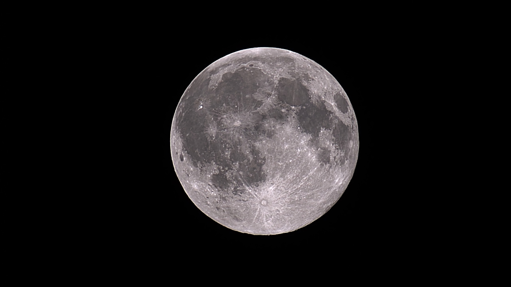

*The full Moon, 26 September 2026, DWARF Mini, Richard Sutcliffe.*

Silent macOS menu-bar app: tells you when tonight is clear enough for a long imaging session, and what to point at.

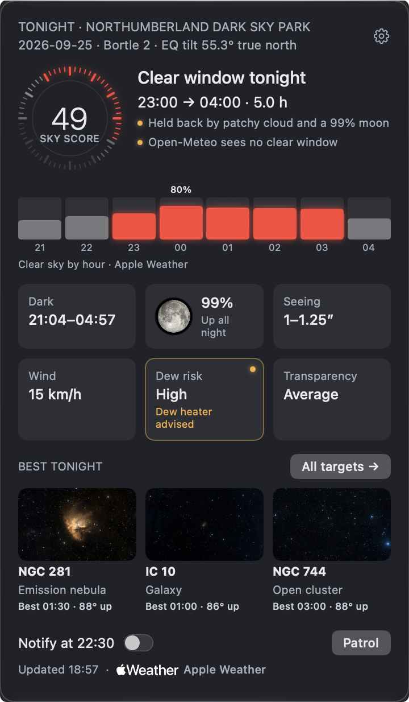

## Screenshots

Taken with version 1.1 and a DWARF Mini, observing from two public dark-sky places: the North York Moors International Dark Sky Reserve (the popover, widgets and the week ahead) and the Malham National Park car park in the Yorkshire Dales Dark Sky Reserve (the rest of the Targets window).

**Alerts:** a heads-up an hour before sunset when tonight looks clear, with your plan and what the second forecast thinks, and a nudge as the clear window opens.


**Tonight's plan:** your favourites that are up in the clear window, in order of their best time, with your telescope's filter and frames, and one altitude chart showing where each is through the night. Two best at the same time are marked, so you can choose; take one off for the night, and the choice is kept.

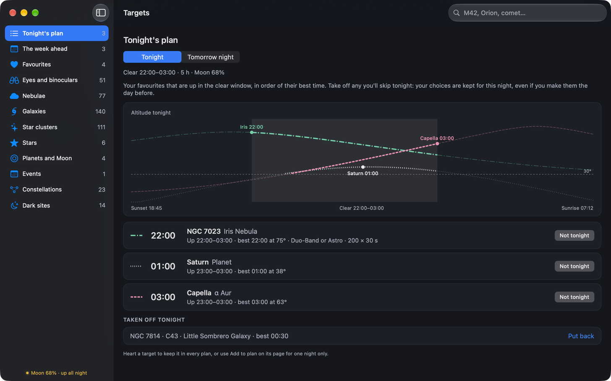

**The week ahead:** up to ten nights in date order, each with its clear window or longest clear run, darkness and the Moon, so the best night of the week is easy to pick. Cloud from three days out is marked "Less certain".


**Tonight or tomorrow night:** the whole Targets window can show tomorrow night instead, so you can plan ahead. Each card says how much of your frame the target fills, and when it is up in the clear window.


**A target's page:** the survey photo fills the window at your field of view, and "How to shoot this" gives your telescope's filter, exposure and frames, sized to the clear window.

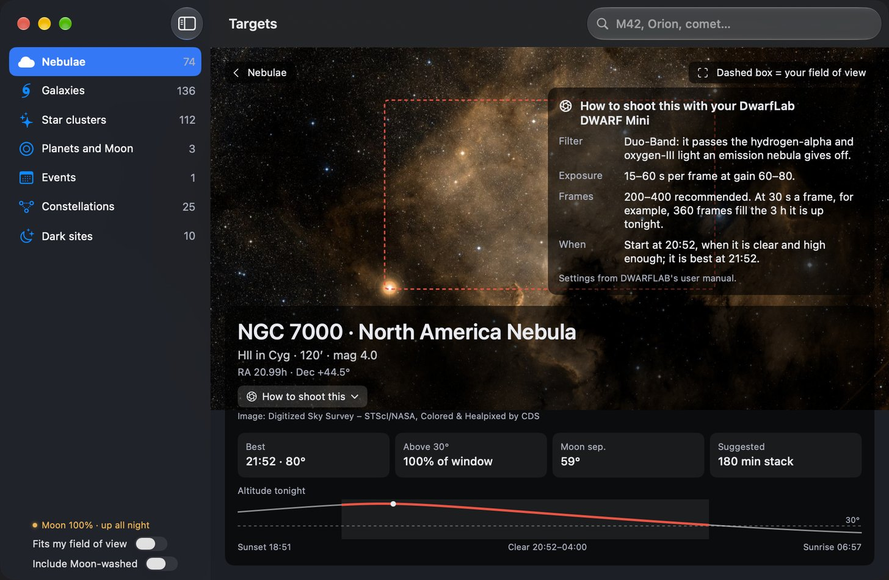

**All 88 constellations:** each one drawn as a figure over its stars.

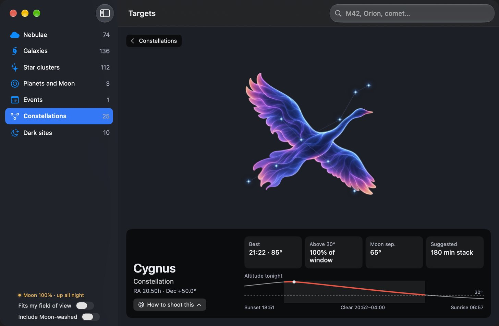

**Dark sites:** darker places nearby, scored for tonight against home, each with a map and Open in Maps.

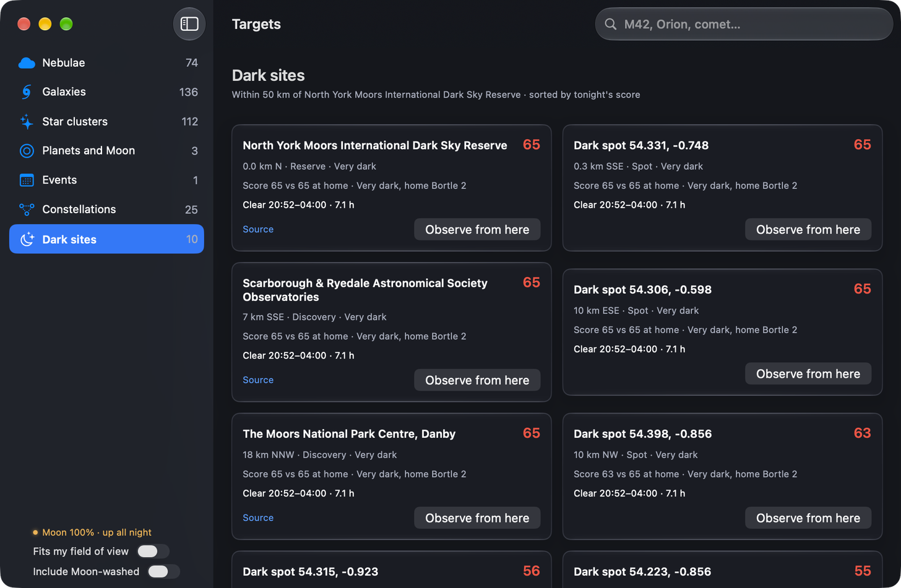

**Your horizon:** how high houses, trees or hills block the sky in each direction, with the hills found from terrain data.

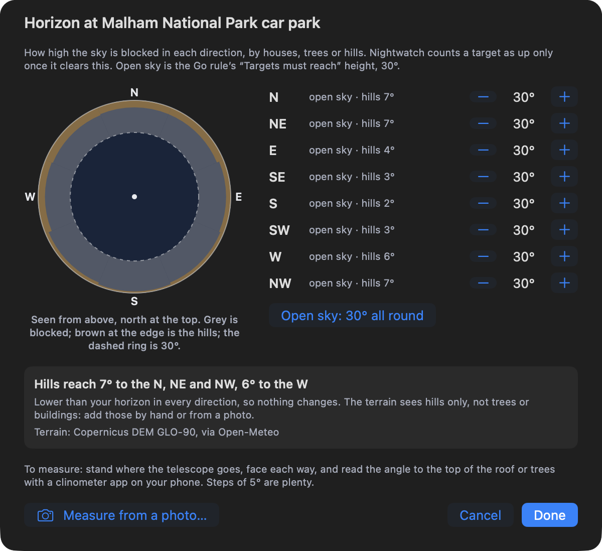

**Events:** meteor showers, eclipses, close pairs, comets and space station passes, each with when and where to look, and Add to Calendar.

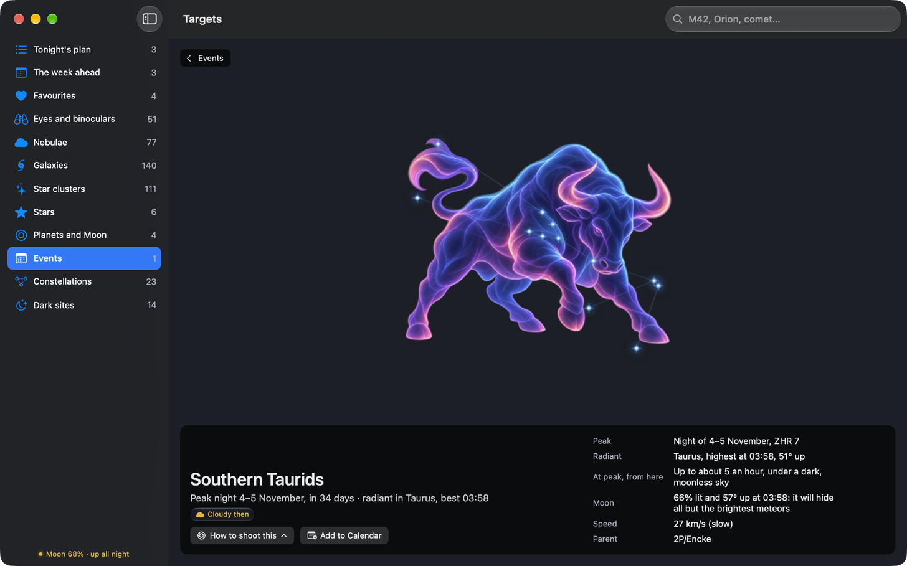

**Desktop widgets:** small, medium and large.

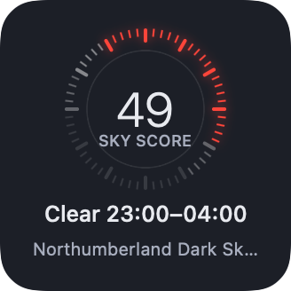 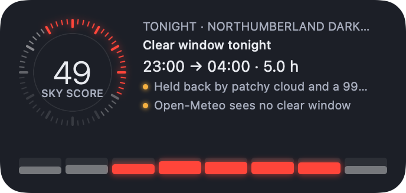 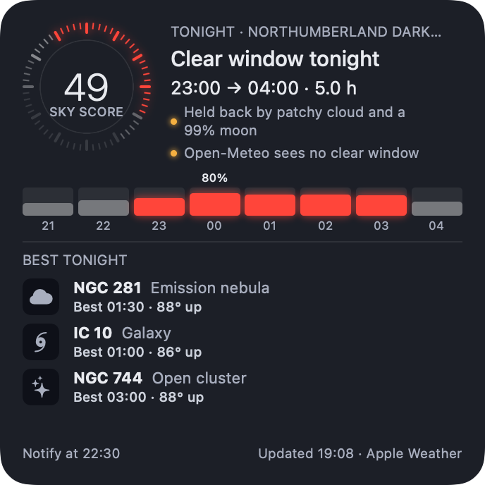

## Download

**[Download Nightwatch.dmg](https://github.com/rsutcliffe/nightwatch/releases/latest/download/Nightwatch.dmg)**, always the newest version, signed and notarised. Open it and drag Nightwatch to Applications. Each [GitHub release](https://github.com/rsutcliffe/nightwatch/releases) also carries the same file as `Nightwatch-<version>.dmg`, with its SHA-256 checksum. The first time you open it, macOS asks whether to open an app downloaded from the internet: choose Open. Nightwatch then asks what you image with and where you observe from; "Use this Mac's location" brings up macOS's location prompt, where you choose Allow. Nightwatch checks GitHub once a day for a newer version and says so in the popover (Settings › Updates turns this off). Questions and ideas are welcome in [Discussions](https://github.com/rsutcliffe/nightwatch/discussions); problems in [Issues](https://github.com/rsutcliffe/nightwatch/issues). How a release is made is in [docs/releasing.md](docs/releasing.md), and the Mac App Store build in [docs/app-store.md](docs/app-store.md).

## Build and install (macOS 14+, Xcode 26 or later)

    brew install xcodegen         # generates the Xcode project from project.yml, once
    git clone https://github.com/rsutcliffe/nightwatch.git && cd nightwatch
    scripts/fetch-data.sh         # optional: only to refresh the bundled catalogue; the data is committed
    scripts/build-app.sh          # builds with Xcode, signs ad hoc, installs to /Applications, launches

Every build runs in Apple's app sandbox, including one signed ad hoc. An ad hoc build gets a new signature each time it is rebuilt; if macOS then asks whether Nightwatch may access its data, choose Allow.

The app and its widget are one Xcode project, generated from `project.yml` by xcodegen (the generated `Nightwatch.xcodeproj` is not committed). SkyCore and NightwatchUI are Swift packages, so the tests run with `scripts/test.sh` alone. The app icon comes from `Resources/AppIcon/Nightwatch.icon`, an Icon Composer document that Xcode compiles into a Liquid Glass icon plus a classic one.

## Desktop widget (optional)

Nightwatch has small, medium and large desktop widgets showing tonight's sky score and verdict. The medium and large ones add the clear-sky bars, and the large one the best three targets. They draw a snapshot the app writes after each refresh, so they always match the popover, and they never fetch anything themselves. Clicking one opens the Targets window; clicking a target on the large one opens its detail.

The widget comes with a signed build only, since it shares its snapshot with the app through an App Group: `scripts/build-app.sh` signs both when an Apple Development certificate and profile are on the Mac. An ad hoc build leaves the widget out.

To add it: right-click the desktop › Edit Widgets… › Nightwatch. If widgets won't stay on the desktop, turn on System Settings › Desktop & Dock › Widgets › Show widgets › On Desktop.

If the widget shows only grey bars after you replace an older copy of Nightwatch with a newer one, macOS is still holding the old version on record and throws away what the new widget draws. Nightwatch can't correct this from inside its sandbox. Run these two commands in Terminal, and the widget fills in within a minute; if it doesn't, remove it and add it again:

```bash
/System/Library/Frameworks/CoreServices.framework/Frameworks/LaunchServices.framework/Support/lsregister -f -R -trusted /Applications/Nightwatch.app
killall chronod
```

## Tests

    scripts/test.sh

## What it does

- Every 30 minutes it fetches cloud, dew point, wind and visibility for your site from Apple Weather (WeatherKit) when the app is signed for it, or from Open-Meteo otherwise, plus 7Timer for seeing and transparency. The popover footer says which one drove tonight's verdict.
- It computes astronomical darkness, Moon, planets and target visibility locally with Astronomy Engine. Nothing leaves your Mac except the forecast requests, sky-survey thumbnails from CDS, the Moon image from NASA, comet/ISS element downloads, Apple Maps place names for dark spots, the aurora status after dark when aurora alerts are on (AuroraWatch UK's, or NOAA's forecast outside the UK and Ireland), and the download's once-a-day update check. [PRIVACY.md](PRIVACY.md) says what each one receives.
- A night qualifies when there is a contiguous run of at least 3 hours inside astronomical darkness with cloud at or under 25 %. Thin high cloud counts for half, since stacking and noise reduction work through it; low and middle cloud count in full. When a night misses, the popover says by how much ("Longest clear run is 1 h from 22:00; the rule needs 3 h").
- The go rule is yours to set, in Settings › Go rule:

  | Setting | Default | Range | Loosen it when |
  |---|---|---|---|
  | Clear for at least | 3 h | 1–8 h | you shoot short sessions, or bright targets that need fewer frames |
  | Cloud cover at most | 25 % | 5–60 % | you're happy to take a chance on patchy cloud; stacking rejects frames spoiled by passing cloud |
  | Targets must reach | 30° altitude | 10–60° | you have a low, clear horizon (or set the horizon per site: see *Your horizon*) |

  Loosening it means more nights qualify, and more alerts, some of them for nights that turn out patchy. Tightening it means fewer, surer nights. Every part of the app follows the same rule: the popover's verdict, the clear window, the hour bars, the alerts and the targets it recommends.
- Alerts: a heads-up one hour before local sunset, a nudge 30 minutes before the window opens (both on the minute: Nightwatch checks again at each, rather than waiting for its half-hourly refresh), and a cancel notice if the forecast turns. Quiet hours default to 00:00–07:00. Nothing fires from a forecast older than six hours. The first clear window after installing opens its alert with "Your first clear window with Nightwatch", once. When tonight is clear, the heads-up ends with up to two events in clear sky, for example "Also tonight: ISS pass at 21:14, Orionids at peak at 03:00" (a shower only on its peak night, never a comet, and nothing behind your horizon).
- Bright nights (opt-in, Settings › Bright nights): from about early May to early August at British latitudes there is no proper darkness, so the dark rule can never be met. With this on, Nightwatch suggests the Moon and the naked-eye planets instead and alerts for a one-hour clear run in nautical darkness (Sun 12° down) with a target at least 15° up. Deep-sky targets are never suggested on a bright night.
- Aurora (opt-in, Settings › Aurora): after dark, Nightwatch checks the aurora status and alerts when it reaches your threshold (default amber) and this hour's forecast is clear. At sites in the UK and Ireland the status is AuroraWatch UK's (Lancaster University, under its non-commercial terms), checked every 5 minutes. Everywhere else it is the 30-minute aurora forecast from NOAA's Space Weather Prediction Center, read at your site every 15 minutes and shown as yellow from 10%, amber from 30% and red from 60%; those bands are Nightwatch's own. It reads the forecast at your site only, so it can stay quiet when an aurora is low on the horizon. Quiet hours apply to aurora alerts too, and around midsummer the default quiet hours (00:00–07:00) cover almost all of the dark part of the night, so shorten them if you want summer aurora alerts.
- The menu-bar icon shows tonight at a glance:

  | Icon | Meaning |
  |---|---|
  | Star outline (☆) | No clear window tonight |
  | Star in a circle (⊛) | A clear window tonight, still to come |
  | Filled star (★) | The window is open, or opens within 30 minutes: time to set up |
  | Star with a slash | The forecast is more than six hours old, for example while offline |

- The popover (v0.4 "Jingo") shows:
  - the sky score inside a 12-hour clock bezel whose ticks glow in your accent colour across tonight's clear window
  - the window time, with a "Held back by…" line naming what costs the score points (a bright Moon, dew, wind, seeing, cloud)
  - on a build signed for Apple Weather, a second-opinion line from Open-Meteo (v0.5 "The Fifth Elephant"): "Open-Meteo agrees" or "Open-Meteo agrees: no clear window". Where it differs, one plain line says what it means: "Check again at 20:30: a second forecast sees 21:00–01:00 clear." when there is no window, or "Less certain: a second forecast sees cloud from 00:00." when there is one. The verdict still comes from Apple Weather alone. The widgets carry the same line, and the evening heads-up and the nudge before the window end with "A second forecast sees cloud from 00:00, so this window is less certain than usual." Settings › Alerts › "Alert only when Open-Meteo agrees" holds an alert back when Open-Meteo is not clear enough inside the window. Nothing is logged: the second opinion lives in the forecast cache and is replaced on every refresh
  - clear-sky bars, one per hour of darkness, taller for clearer
  - one notice line (aurora, or a clearer dark site nearby)
  - six tiles, with the dew tile turning yellow when a heater is advised
  - the best three targets
  - the Apple Weather mark (a link to its legal attribution), the update time and Refresh, on one line
  - Settings (the gear) and Quit (the power button, or ⌘Q) at the top
- The target browser groups what is up during the window into nebulae, galaxies, star clusters, stars (the 49 named stars of magnitude 2 or brighter, for focusing and alignment), planets and Moon, events (meteor showers, eclipses, conjunctions, comets, ISS passes) and constellations, with DSS2 thumbnails. Every card has:
  - a timeline of the clear window, lit where the target is viewable and brighter where it is higher, with its best moment marked
  - a chip saying how much of your field of view it fills
  - a yellow chip when the Moon washes it out or sits close by

  Events (meteor showers, eclipses, conjunctions, comets, ISS passes, and the Moon covering a planet, a bright star or the Pleiades) say when and where to look and whether tonight is clear then, on the same cards and pages as the targets, and each opens a page with the details and how to photograph it: the radiant, best hour and likely rate for a shower; where the ISS appears and fades; whether a close pair fits your field of view. Add to Calendar on an event's page hands it to your calendar app with a 15-minute alert; a shower whose peak is still to come goes in on its peak night, with that night's best hour. An event hidden by your horizon says "Behind your horizon". When the Moon will cover a planet, a bright star or the Pleiades in darkness, the page draws each star's path behind it, with when it goes and comes back and at which edge of the Moon, and the Events page lists the next few under "Coming up", each with Add to Calendar.

  The heart on a card or a target's page adds it to Favourites, the first group in the sidebar. It lists every favourite, whether or not it is in tonight's list; one that is not usable tonight is dimmed with the reason ("Below 30° in tonight's window", or "Behind your horizon in tonight's window" at a site with a horizon). When a favourite is well placed on a clear night, it takes one of the popover's three best-target slots.

  The header has a slim clear-sky strip and a sort control (Best now, Altitude, Size, Brightness; "Best now" reads "Highest" on a night with no clear window). On a night with no clear window the header says so once, cards show when each target is up in darkness in grey, and whenever tomorrow night has a forecast a Tonight | Tomorrow night switch replans the window for it. Search finds a target by name, by kind ("galaxy", "globular") or by its Messier, Caldwell, NGC or IC number ("C43" or "C 43"); a line under the header, in larger yellow text, says how many it found and which other groups have matches. While searching, matches the Moon-washed and field-of-view switches would hide still show, placed last.
- On macOS 26 and later the popover and cards use Liquid Glass. On macOS 14 and 15, or with Reduce Transparency on, the same layout draws on a solid dark fill. Clear sky is drawn in the accent colour chosen in System Settings (blue with Multicolour), and nothing else uses it on the popover and the target cards. Warnings are yellow, with a dot and words. With Increase Contrast on, cards turn solid with brighter grey text and outlined tiles; with Larger Text or a small screen the popover scrolls rather than cutting off its footer, and Targets drops to two columns; with Reduce Motion on, scrolling to a card or term jumps instead of gliding.

## Telescope

Any. Pick a preset (DWARF Mini, DWARF 3, Draco, Seestar S50, APS-C at 200 mm) or type your field of view in degrees.

Spotlight runs Nightwatch's actions: type **Sky Score**, **Best Targets Tonight**, **Events Tonight** or **Refresh Forecast** and choose the Nightwatch result for a card with the answer and the forecast's source. They are in Shortcuts too, with Show Target and clear-sky notifications on or off. On macOS 27, Siri can search Nightwatch: "Find the Crescent Nebula in Nightwatch" opens the Targets window with that search.

The Targets window also has **Eyes and binoculars**, a group of what you can see tonight without a telescope, judged by how bright each object is per patch of sky against your sky's darkness, with the Milky Way for a camera and wide lens: its core in Sagittarius when it clears 10° in darkness (shown dimmed in summer, with the reason, where it never does, as from Yorkshire) and the band through Cygnus; the next run of moonless nights in its header; and **What the numbers mean**, a window explaining every figure the app shows.

**Tonight's plan** is the first page of the Targets window: your favourites that are up in the clear window, in order of their best time, each with when it is up, its height at best, and your telescope's filter and frames where the maker publishes them. Two favourites best within half an hour of each other are marked, so you can choose. Not tonight takes one off for that night, Put back returns it, and Add to plan on a target's page adds any other target for one night. Your choices are kept for each night, sync between your Macs, and still apply when the night you planned as "tomorrow" comes. Favourites that cannot be in the plan are listed with the reason, and the plan ends with the clear window, or earlier if you set a finish time in Settings › Tonight's plan (for bed or an early start).

**The week ahead**, second in the Targets sidebar, lists tonight and the next nights, as far as the forecast reaches (up to ten), one row per night in date order: the clear sky by hour, the clear window or the longest clear run, darkness, the Moon, and seeing for the first three nights. It makes the best night of the week easy to pick. Moon and darkness are exact; cloud from three days out is marked "Less certain", with how many days ahead it is. Tonight and tomorrow have an Open plan button.

## Your horizon

Houses, trees and hills hide part of the sky. Settings › Where you observe › **Horizon…** on a saved site sets how high the sky is blocked towards N, NE, E, SE, S, SW, W and NW, drawn on a dial of the sky seen from above. Nightwatch then counts a target as up only once it clears the horizon in its direction: the target lists, the popover's best three, Tonight's plan ("Clear of your horizon 22:50–00:20"), each target's best time and the altitude chart all follow it, and events hidden by it are marked. The horizon only ever raises the bar: the go rule's "Targets must reach" still sets the lowest height worth imaging through, since below about 20° a target's light crosses three times the air or more, so a direction below it changes nothing and reads "below your Go rule".

Each saved site's hills are checked once, from terrain data (Copernicus DEM, 90 m, via Open-Meteo's elevation API), when the site is saved or moved, and kept with the site and synced through iCloud. The dial draws them as a brown band and each direction notes their height ("hills 7°"). They change nothing unless they stand above what is set, as beside a cliff or in a steep valley, when the sheet offers to raise those directions. Terrain sees hills only, never trees or buildings.

**Measure from a photo…** works out a direction from a phone photo taken where the telescope stands: it reads which way the photo faced, the lens and (on an iPhone) the phone's tilt, and you drag a line to the top of the roof or tree. It rounds up to the next 5°. It also says where the photo was taken against the site, and offers to move the site there if it is between 50 m and 5 km away. The results are a guide, not a survey: your mileage may vary, so check the steepest directions with a level or clinometer app. The photo is read on your Mac and not kept.

## Dark-sky sites

The Targets window's "Dark sites" group lists two kinds of place: certified sites (DarkSky International parks, reserves, sanctuaries and communities, plus 25 UK Dark Sky Discovery Sites) from a bundled list of 76 places compiled from Wikidata and hand-verified UK and Ireland entries, and up to five computed "dark spots" from the bundled light-pollution grids (Britain at about 0.9 km, the rest of the world between 75° N and 65° S at about 5.5 km), each moved to the nearest car park Apple Maps knows within 8 km that the light-pollution data still shows as dark, and named after it and its nearest town ("Euro Car Parks near Hetton", or "Car park near Kettlewell"); a spot with no dark car park in reach is left out, and computed cards say "Found from light-pollution data: check access and park considerately". Every dark-site card shows a small Apple Maps map with the site pinned, and Open in Maps opens it in Maps for a closer look or directions. Each card shows distance, bearing, a darkness band or Bortle class, tonight's clear window and a score. Forecasts are fetched for the nearest eight sites. "Observe from here" observes from that site without saving it: the popover and the Dark sites page offer "Back to" your home site, and Settings › Where you observe can Keep it. When a listed site scores 20 or more above home, the popover shows one line naming it.

Each card compares tonight's score and sky with home ("Score 61 vs 37 at home · Dark, home Bortle 5"), and the popover's "Clearer sky" line opens that site's card. Cached site forecasts are kept only for the sites currently listed and for a day.

Settings › Dark sites turns the group on or off and sets the search radius, 5 to 300 km (default 50), in kilometres or miles.

The bands (Very dark, Dark, Rural, Suburban, Bright) are Nightwatch's own thresholds on VIIRS upward radiance (under 0.25, 0.25 to 1, 1 to 5, 5 to 20, 20 and over nW/cm²/sr) — a heuristic, not a Bortle class. Certified places show a Bortle class only when the source states one.

To build a grid for another region, register for a free account at https://eogdata.mines.edu/products/vnl/, download the latest annual "average_masked" GeoTIFF (about 11 GB unpacked) and the Natural Earth 10 m land polygons (public domain, https://www.naturalearthdata.com), then run:

    python3 -m venv .venv && .venv/bin/pip install -r scripts/requirements-data.txt
    curl -fsSLO https://raw.githubusercontent.com/nvkelso/natural-earth-vector/master/geojson/ne_10m_land.geojson
    .venv/bin/python scripts/build-lp-grid.py /path/to/VNL_*average_masked*.tif --bbox SOUTH,WEST,NORTH,EAST --cell 0.01 \
        --smooth 7 --land ne_10m_land.geojson --out Sources/SkyCore/Resources/lightpollution/<region>.lpgrid

The masked product stores unlit land and the sea as exactly 0. `--land` writes cells whose centre is not on land as no-data so the sea is never offered as a dark spot, and `--smooth 7` averages each cell with its 7 × 7 neighbourhood so a masked zero beside a town does not read as darkest. Among equally dark cells the nearest is offered first.

The world grid (`Resources/LightPollution/world.lpgrid`) covers everywhere else: 2,800 × 7,200 cells at 0.05° (about 5.5 km), one byte per cell on a log scale, 20 MB on disk and about 2 MB in the download. It is built from the whole file:

    .venv/bin/python scripts/build-lp-grid.py /path/to/VNL_*average_masked*.tif --world --cell 0.05 --smooth 1 \
        --land ne_10m_land.geojson --out Resources/LightPollution/world.lpgrid

Each of its cells is the mean of 12 × 12 source pixels, about the British grid's smoothing window, so it needs no further smoothing. A cell counts as land when at least a quarter of it is, and its value is the mean over its land alone, so a coastal town is neither called sea nor diluted by it. The app reads it through a memory map and uses the finer British grid wherever that has a value.

The bundled UK grid (`gb.lpgrid`, bbox 49.8,-8.7,60.9,1.8) is 1,332 × 1,260 cells at 0.00833° (about 0.9 km), 6.4 MB. The script rounds `--cell` to a whole multiple of the source's 15-arc-second pixels, so `--cell 0.01` produces 0.00833° cells. The app loads every `.lpgrid` file in that folder. Keep rows and columns under 65,535: use a larger `--cell` for big regions.

Certified by DarkSky International or the UK Dark Sky Discovery Sites programme; coordinates from Wikidata (CC0). The light-pollution grids were made utilizing VIIRS Nighttime Lights data produced by the Earth Observation Group, Payne Institute for Public Policy, Colorado School of Mines (CC BY 4.0; cropped or averaged, sea masked, and for the world grid stored on a log scale); land mask made with Natural Earth (public domain).

## Apple Weather (optional)

The download and the Mac App Store version use Apple Weather. A build of your own uses Open-Meteo and needs no account. If an Apple Development certificate and a provisioning profile for `io.github.rsutcliffe.nightwatch` (with the WeatherKit capability) are on your Mac, `scripts/build-app.sh` signs the app with the WeatherKit entitlement and Apple Weather becomes the primary cloud source, with Open-Meteo as the fallback. Nothing secret enters the repo: the certificate stays in your keychain and the profile under `~/Library/Developer`. That bundle id belongs to the maintainer's Apple Developer team, so only the maintainer can get a profile for it; anyone else's build uses Open-Meteo, which needs nothing.

## Settings sync

Settings sync between Macs signed in to the same iCloud account, through iCloud key-value storage: sites and home, telescope, go rule, alerts and quiet hours, dark sites, bright nights, aurora, favourites and Tonight's plan. Home is shared whole: star a saved site and it is home on every Mac; star This Mac's location and each Mac uses its own. Start at login, text size, where each Mac is observing from and the first-run welcome stay on each Mac. At launch the newer copy wins; while Nightwatch runs, a change on one Mac reaches the others. Not signed in to iCloud, settings stay on the Mac, and Settings › App says so. Reset config in Settings resets every Mac, and its confirmation says so.

Settings are kept in the app's sandbox folder, `~/Library/Containers/io.github.rsutcliffe.nightwatch/Data/Library/Application Support/Nightwatch/config.json`; settings from 0.6.x are copied there on first launch.

## Data sources and licences

See `NOTICE`. Weather data by Open-Meteo.com (CC BY 4.0). 7Timer data is for non-commercial use. OpenNGC is CC BY-SA 4.0. Sky-survey images are the Digitized Sky Survey (STScI/NASA), coloured by CDS under ODbL 1.0 and used under STScI's terms for non-profit use; the plates are copyright AAO, SERC, Caltech and AURA. Nightwatch is free and has no ads, which every non-commercial term above requires. The constellation artwork is original to Nightwatch, created for it with ChatGPT image generation; only the star positions and lines under it come from d3-celestial (BSD-3-Clause). Dark-sky site attributions are in "Dark-sky sites" above.

## Release names

Tags follow the City Watch novels: 0.1 Guards! Guards!, 0.2 Men at Arms, 0.3 Feet of Clay, 0.4 Jingo, 0.5 The Fifth Elephant, 0.6 Night Watch, then Thud! and Snuff. After the Watch novels come other Discworld names: 1.1 Pseudopolis Yard, the Watch's headquarters.
